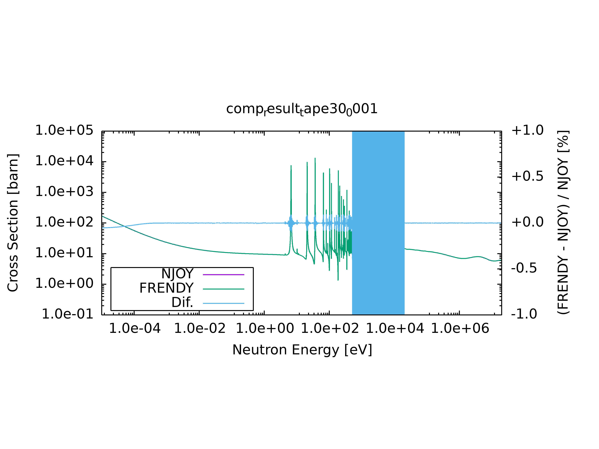
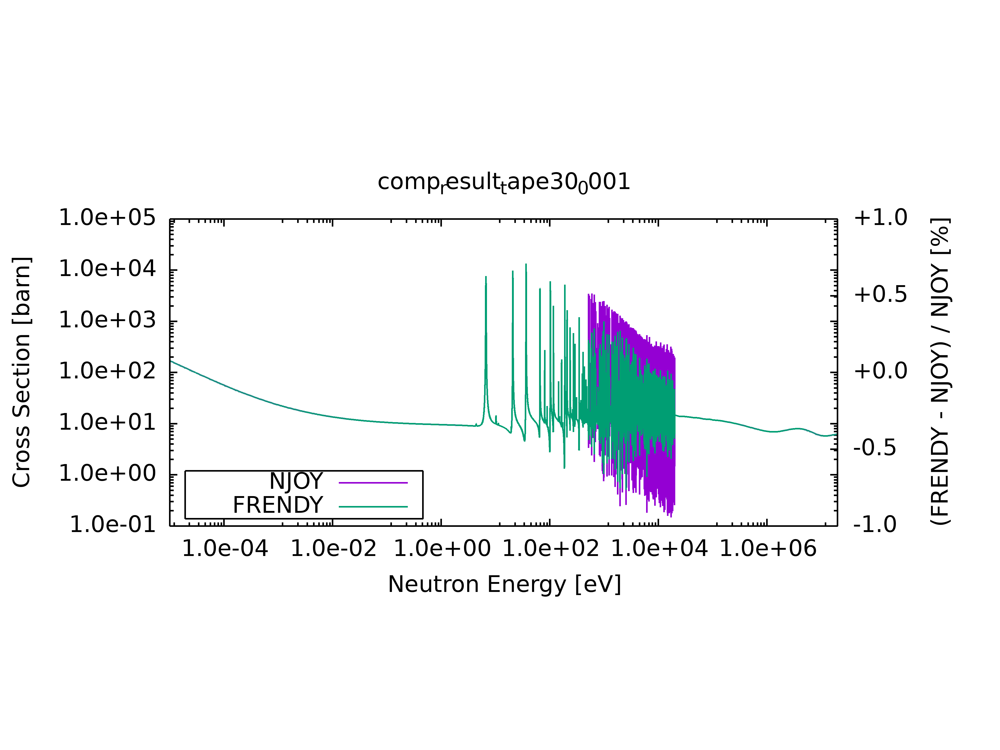
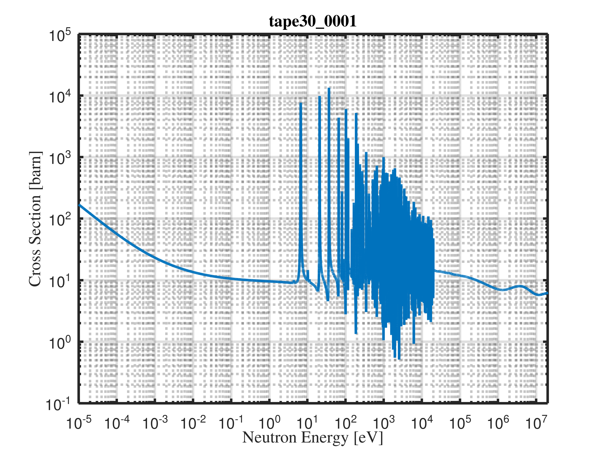

# NJOY vs FRENDY Cross Section Comparison

This repository provides a framework for comparing evaluated nuclear data processed by two major nuclear data processing systems: **[NJOY](https://github.com/njoy/NJOY2016)** and **[FRENDY](https://rpg.jaea.go.jp/main/en/program_frendy/)**.

## 📘 Overview

The goal of this project is to:
- Process ENDF-formatted nuclear data files using both NJOY and FRENDY.
- Extract and visualize ACE-format cross section data.
- Perform a systematic comparison between the two outputs.
- Identify discrepancies and evaluate consistency across different energy groups and reactions.

## 🔧 Installation (Linux / Ubuntu)

### 📋 Prerequisites
### NJOY2016
Ensure the following packages are installed:
```bash
sudo apt update
sudo apt install git cmake gfortran build-essential

####To download and compile NJOY2016:

git clone https://github.com/njoy/NJOY2016.git
cd NJOY2016
mkdir build
cd build
cmake -DCMAKE_BUILD_TYPE=Release ../
make -j$(nproc)
```
### FRENDY
Ensure the following packages are installed:
```bash
sudo apt-get update
sudo apt-get upgrade
sudo apt-get install tcsh build-essential gcc libboost-all-dev liblapack-dev libblas-dev libeigen3-dev
wget https://rpg.jaea.go.jp/download/frendy/frendy_20241030.tar.gz
tar -xvzf frendy_YYYYMMDD.tar.gz
cd frendy_YYYYMMDD/frendy
csh ./compile_all.csh
cd sample/run
csh ./run_frendy.csh
```
### Running
Frendy runnig :
```bash
git clone https://github.com/emilmammadzada99/njoy-frendy-comparison.git
cd njoy-frendy-comparison/fr/
:~/fr$ cp n-092_U_238.endf tape20
:~/fr$ ~/frendy_20241030/frendy/main/frendy.exe n-092_U_238.dat
```
NJOY runnig:
```bash
cd njoy-frendy-comparison/nj/
:~/nj$ cp n-092_U_238.endf tape20
:~/nj$ njoy < n-092_U_238.njoy
```
Comparison Plotting :
```bash
cd njoy-frendy-comparison/
:~/njoy-frendy-comparison$ chmod +x compare.csh   
:~/njoy-frendy-comparison$ ./compare.csh # created out directory in njoy-frendy-comparison for comparison
:~/njoy-frendy-comparison$ chmod +x  plot_all.csh
:~/njoy-frendy-comparison$ ./plot_all.csh # created ace_plot  ace_plot_only directory in njoy-frendy-comparison for comparison
```
Plotting Only Frendy Data:
```bash
cd njoy-frendy-comparison/fr_single/
:~/njoy-frendy-comparison/fr_single$ cp -r ~/njoy-frendy-comparison/fr  ~/njoy-frendy-comparison/fr_single
:~/njoy-frendy-comparison/fr_single$ chmod +x plot_single.csh
:~/njoy-frendy-comparison/fr_single$ ./plot_single.csh #create only frendy data out directory
:~/njoy-frendy-comparison/fr_single$ chmod +x plot_frendy.csh
:~/njoy-frendy-comparison/fr_single$ ./plot_frendy.csh #create plot directory
```
Comparison Plotting with Octave:
```bash
cd njoy-frendy-comparison/gnuplot/
:~/njoy-frendy-comparison/gnuplot$ cp -r ~/njoy-frendy-comparison/out ~/njoy-frendy-comparison/gnuplot
:~/njoy-frendy-comparison/gnuplot$ mv out comp_out
:~/njoy-frendy-comparison/gnuplot$ cp -r ~/njoy-frendy-comparison/fr_single/out ~/njoy-frendy-comparison/gnuplot
:~/njoy-frendy-comparison/gnuplot$ mv out single_out && ls
comp_out single_out 
:~/njoy-frendy-comparison/gnuplot$ mkdir comp_plot single_plot
:~/njoy-frendy-comparison/gnuplot$ cd single_plot
:~/njoy-frendy-comparison/gnuplot/single_plot$ octave plot_single.m  #plot directory created
:~/njoy-frendy-comparison/gnuplot/comp_plot$ octave plot_xs.m #created ace_plot  ace_plot_only directory in njoy-frendy-comparison for comparison
```
### Images 



